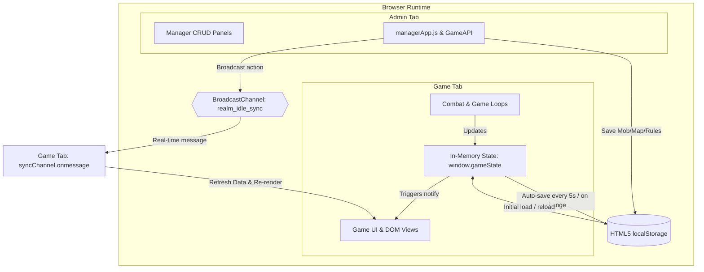

# Realm Idle RPG — Data Storage & Serverless Architecture Guide

This document explains how **Realm Idle RPG** operates entirely in the browser without requiring a backend server, how game state and configuration data are stored and persisted, and how real-time cross-tab synchronization and offline progression function.

---

## 1. Architectural Overview: The "Serverless" Client Engine

Realm Idle RPG is built as a **100% client-side Single Page Application (SPA)** using standard web technologies:
- **HTML5** for semantic UI layout, modal dialogues, and views.
- **CSS3** with modern custom properties (CSS variables), Flexbox, CSS Grid, and media queries for responsive layouts.
- **Vanilla JavaScript (ES6+)** running directly in the client's browser JavaScript engine (V8 in Chrome/Edge, SpiderMonkey in Firefox, JavaScriptCore in Safari).



### Why No Backend Server Is Needed
1. **Zero Compute Overhead**: All mathematical calculations—such as damage rolls, critical strike RNG, armor damage reduction, experience curve evaluation, and loot drop rolls—are performed locally in CPU memory.
2. **Instant Performance**: There are no network latency bottlenecks (0ms ping). Assets and state updates execute instantaneously.
3. **Offline Playability**: The game can run on airplanes, offline devices, or local environments without any active internet connection.

---

## 2. In-Memory State & Reactive Game Loop

### 2.1 The Central State Model (`window.gameState`)
Located in [`Realme Idle/js/core/state.js`](file:///c:/Users/nitin/OneDrive/Desktop/Real-main/Realme%20Idle/js/core/state.js), `window.gameState` acts as the single source of truth for the active game session:
- **`player`**: Level, XP, current HP, max HP, attack, defense, gold, gender, class ID, active equipment slots (`weapon`, `armor`, `ring`), consumables (`potions`), materials, and kingdom upgrades.
- **`combat`**: Current enemy mob object, enemy HP, autofight state (`autoFight: true/false`), current stage (`stage: 1-10`), and sanctuary state (`inTemple: true/false`).
- **`world`**: Active realm map ID, unlocked realms array, active weather phenomenon, and time of day.
- **`guildIncome`**: Adventurer's Guild stipend config (`{ enabled: true, goldPerSecond: 3 }`).
- **`templeDonation`**: Sanctuary tithe recovery config (`{ enabled: true, cost: 50 }`).

### 2.2 The Observer Pattern (`notify()`)
Whenever any game system modifies `gameState` (e.g. buying a shop item, defeating a mob, equipping armor, or taking damage), it invokes:
```javascript
window.gameState.notify();
```
All registered subsystem listeners (UI renderer, health bars, inventory grid, stage progress bar, and resource pill indicators) automatically re-render their respective DOM nodes, eliminating UI desynchronization.

### 2.3 The Tickers (Loop Timers)
The game utilizes standard browser timers managed in [`Realme Idle/js/main.js`](file:///c:/Users/nitin/OneDrive/Desktop/Real-main/Realme%20Idle/js/main.js):
- **Combat Tick (`setInterval` @ ~1000ms)**: Executes automated hero attacks and enemy retaliations when `combat.autoFight === true` and the hero is not in the Temple of Revival.
- **Guild Stipend / Passive Gold Ticker (`setInterval` @ 1000ms)**: Grants the configured Adventurer's Guild stipend every second multiplied by kingdom treasury modifiers.
- **World Cycle Ticker (`setInterval` @ 10,000ms)**: Advances game world time and checks environmental weather triggers.
- **Auto-Save Ticker (`setInterval` @ 5000ms)**: Flushes in-memory state to persistent browser storage.

---

## 3. How Data Is Stored (HTML5 `localStorage`)

Data is persisted on the user's local disk via the HTML5 **Web Storage API (`localStorage`)**, a synchronous key-value store scoped strictly to the origin (domain or local file origin).

### 3.1 Persistent Storage Keys

| Storage Key | Managed By | Contents & Purpose |
| :--- | :--- | :--- |
| `realmIdleRootSave` | `state.js` | Full player state (level, gold, inventory, equipment, current realm, stage, last timestamp). |
| `realmIdleCustomData` | `gameApi.js` | Admin customizations: custom mobs, maps, hero classes, items, weather, and shop items. |
| `realmIdle_cfg_guildIncome` | `gameApi.js` | Guild Stipend rules (`{ enabled: boolean, goldPerSecond: number }`). |
| `realmIdle_cfg_templeDonation`| `gameApi.js` | Temple Tithe rules (`{ enabled: boolean, cost: number }`). |

### 3.2 Data Serialization & Error Handling
Storage values in `localStorage` are stored as UTF-16 JSON strings. 
- **Saving**:
  ```javascript
  save() {
      const data = {
          player: this.player,
          combat: {
              currentRealm: this.combat.currentRealm,
              currentStage: this.combat.currentStage,
              unlockedRealms: this.combat.unlockedRealms,
              autoFight: this.combat.autoFight,
              inTemple: this.combat.inTemple
          },
          world: this.world,
          guildIncome: this.guildIncome,
          templeDonation: this.templeDonation,
          lastSaved: Date.now()
      };
      localStorage.setItem("realmIdleRootSave", JSON.stringify(data));
  }
  ```
- **Loading & Fallbacks**:
  If the saved JSON string is corrupted or missing, a `try...catch` block gracefully catches the error and initializes fresh starting templates from default data files (`heroes.js`, `mobs.js`, `maps.js`).

### 3.3 When Does the Game Save?
1. **Periodic Loop**: Automatically every 5 seconds in the background.
2. **Tab Exit / Reload**: Attached to the browser's `window.addEventListener("beforeunload", ...)` lifecycle event.
3. **Milestone Events**:
   - Defeating a Stage 10 Boss and unlocking a new realm.
   - Purchasing equipment, consumables, or materials from the Shop.
   - Forging or upgrading gear at the Blacksmith.
   - Resurrecting at the Temple of Revival.

---

## 4. Cross-Tab Communication Without a Server (`BroadcastChannel`)

One of the standout features of Realm Idle is that you can open the **Game** in one tab and the **Admin Manager (`manager.html`)** in another tab, make balance changes, and see them apply **instantly in the game without reloading the page or running a WebSocket server**.

### How It Works:
Both tabs instantiate the HTML5 `BroadcastChannel` interface:
```javascript
const syncChannel = ("BroadcastChannel" in window) ? new BroadcastChannel("realm_idle_sync") : null;
```

1. **Admin Tab**: When an admin adjusts mob health, creates an item, or changes the Adventurer's Guild stipend, the manager updates `localStorage` and broadcasts a message:
   ```javascript
   syncChannel.postMessage({ action: "RULES_UPDATED", rules });
   ```
2. **Game Tab**: Listens on the same channel:
   ```javascript
   syncChannel.onmessage = (event) => {
       GameAPI.data.loadCustomData();
       GameAPI.settings.loadRules();
       window.gameState.notify(); // Triggers UI re-render
   };
   ```
This operates entirely via the browser's internal IPC (Inter-Process Communication), with zero network traffic.

---

## 5. Offline Progression Without a Server

Because there is no background server running while the browser tab is closed, offline gains are calculated **mathematically upon return** using time differentials:

```mermaid
flowchart LR
    A[Tab Closed] -->|Store lastSaved = Date.now()| B[(localStorage)]
    B -->|Time passes while offline...| C[Player Reopens Tab]
    C -->|Read lastSaved| D{Calculate Delta: Date.now() - lastSaved}
    D -->|Autofight was ON| E[Grant Combat Kills, XP, Gold, Loot Rolls]
    D -->|Autofight was OFF| F[Grant Peaceful Exploration XP & Guild Gold]
    E --> G[Display Detailed Offline Report Modal]
    F --> G
```

1. **Delta Calculation**:
   ```javascript
   const elapsedSeconds = Math.floor((Date.now() - saved.lastSaved) / 1000);
   ```
2. **Safety Thresholds**:
   - If `elapsedSeconds < 15`, no offline modal is shown (prevents modal spam on quick refreshes).
   - A maximum cap (e.g. 12 hours) prevents game-breaking inflation if a player returns after months.
3. **Autofight Mode Discrimination**:
   - **Autofight Was Active (`combat.autoFight === true`)**: Simulates 1 kill every ~3 seconds, generating realistic XP, gold, monster drop table rolls, and potion drops.
   - **Autofight Was Inactive (`combat.autoFight === false`)**: Kills are strictly set to `0` and no combat drops are taken. The hero is awarded peaceful exploration training XP and Adventurer's Guild stipend gold.

---

## 6. How to Clear or Reset Data

Players and developers can reset their progress at any time:

1. **In-Browser Debug Panel (F2)**:
   - Press `F2` or open the Hero Quick Menu -> Click **"💥 Clear Save & New Adventure"**.
2. **Browser Console Commands**:
   - Open F12 DevTools Console and execute:
     ```javascript
     clearSave();           // Wipes save and reloads to Onboarding
     resetGame();           // Alias
     startNewAdventure();   // Alias
     ```
3. **UI Footer**: Click the **"👑 New Hero"** button to start fresh.
4. **Data Portability**: The Admin Manager (`manager.html`) provides **"Export JSON"** and **"Import JSON"** buttons on the Data tab, allowing game configurations to be backed up to a `.json` file and transferred across different computers or browsers.

---

## 7. Comparison: Serverless vs. Backend Architecture

| Feature | Current Serverless Architecture | Traditional Backend Architecture |
| :--- | :--- | :--- |
| **Server Hosting Cost** | **$0.00 / Free** (Static files on GitHub Pages/Netlify/S3) | Monthly server, database, and egress fees |
| **Latency / Response Time** | **0ms (Instantaneous)** | 50ms – 300ms network round-trip |
| **Offline Play** | **Full support (No internet needed)** | Requires active internet connection |
| **Maintenance** | **Zero server maintenance, no crashes, no patches** | Database backups, security patches, API uptime |
| **Multi-Device Sync** | Local to current browser (Manual JSON import/export) | Cloud login syncs across phone, PC, tablet |
| **Cheat Prevention** | Client-side (Users can edit console variables) | Authoritative server validates combat math |

### Future Cloud Migration Path (Optional)
If multiplayer, leaderboards, or cloud accounts are ever desired in the future, the code is already prepared:
- [`js/api/gameApi.js`](file:///c:/Users/nitin/OneDrive/Desktop/Real-main/Realme%20Idle/js/api/gameApi.js) acts as an abstraction facade. Replacing `localStorage.setItem()` inside `save()` and `load()` with `fetch("/api/save")` or Firebase/Supabase calls will instantly connect the game to a cloud backend without altering any combat, UI, or rendering logic.
