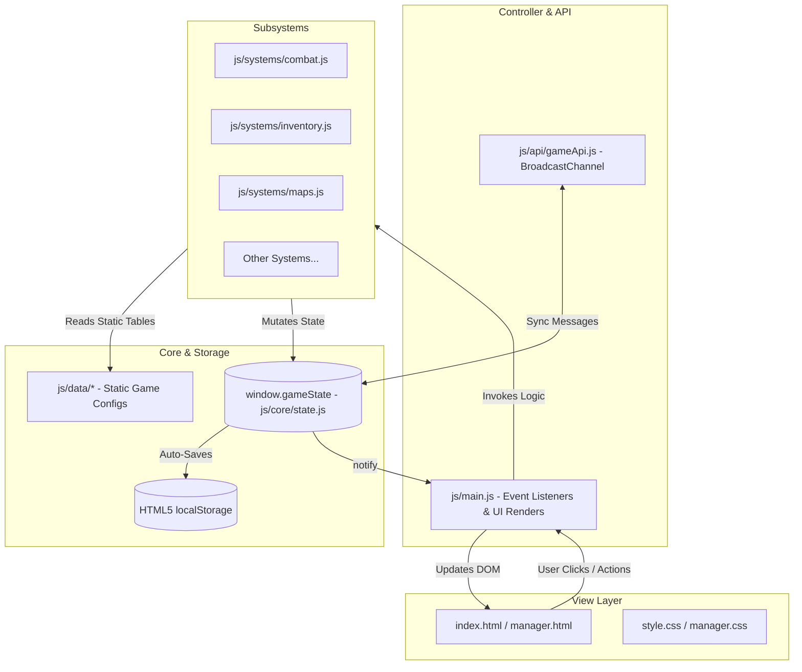

# Realm Idle RPG — Developer Feature Extension Guide
## How to Add New Features, Modify Code, and Master HTML & CSS

This guide is an end-to-end engineering blueprint for developers, contributors, and students who want to build new features into **Realm Idle RPG (Aincrad Edition)**. It covers which files to modify, how to follow established HTML5 and CSS3 design patterns, how to integrate new state variables safely, and provides full code recipes for common game extensions.

---

## Table of Contents
1. [Architecture at a Glance](#1-architecture-at-a-glance)
2. [The Feature-to-File Matrix](#2-the-feature-to-file-matrix)
3. [Script Loading Order in HTML](#3-script-loading-order-in-html)
4. [Mastering the HTML: Layout & Component Patterns](#4-mastering-the-html-layout--component-patterns)
5. [Mastering the CSS: Design System, Glassmorphism & Animations](#5-mastering-the-css-design-system-glassmorphism--animations)
6. [Core State & The Backward Compatibility Law](#6-core-state--the-backward-compatibility-law)
7. [Step-by-Step Implementation Recipes](#7-step-by-step-implementation-recipes)
   - [Recipe A: Adding a New Hero Class & Milestone Passives](#recipe-a-adding-a-new-hero-class--milestone-passives)
   - [Recipe B: Adding a New Realm Map & Depth Tiers](#recipe-b-adding-a-new-realm-map--depth-tiers)
   - [Recipe C: Adding New Items, Equipment & Shop Tiers](#recipe-c-adding-new-items-equipment--shop-tiers)
   - [Recipe D: Adding a Brand-New Game Subsystem (Full Walkthrough: Pet Companions)](#recipe-d-adding-a-brand-new-game-subsystem-full-walkthrough-pet-companions)
8. [Connecting Features to the GM Admin Studio](#8-connecting-features-to-the-gm-admin-studio)
9. [Developer Console Testing (/commands)](#9-developer-console-testing-commands)
10. [Contributor Checklist & Golden Rules](#10-contributor-checklist--golden-rules)

---

## 1. Architecture at a Glance

Realm Idle RPG is a **100% client-side, dependency-free** web application:
- **Presentation**: `index.html` (player UI) and `manager.html` (admin studio).
- **Styling**: `style.css` (player theme) and `manager.css` (admin theme).
- **Static Config**: `js/data/*.js` (dictionaries holding classes, mobs, items, maps, weather, etc.).
- **Dynamic Logic**: `js/systems/*.js` (combat loop, inventory manipulation, realm travel, etc.).
- **Single Source of Truth**: `js/core/state.js` (`window.gameState`).
- **Orchestration**: `js/main.js` (DOM event bindings, render loops, UI synchronization).
- **Cross-Tab Sync**: `js/api/gameApi.js` (`BroadcastChannel("realm_idle_sync")`).



---

## 2. The Feature-to-File Matrix

Use this quick-reference table to identify exactly which files must be created or modified for any given task:

| What do you want to add? | Files you MUST edit | Files you MAY need to edit |
| :--- | :--- | :--- |
| **New Hero Class** | `js/data/heroes.js`<br>`js/core/state.js` | `index.html` (Hero Select modal)<br>`style.css` (Class badges)<br>`js/main.js` (`renderCharacterView`) |
| **New Realm / Map / Depth Tier** | `js/data/maps.js`<br>`js/data/mobs.js` | `style.css` (Background gradient)<br>`js/systems/maps.js`<br>`js/systems/spawning.js`<br>`manager.html` (Map selector) |
| **New Monster / Boss** | `js/data/mobs.js` | `js/data/maps.js` (Assign as stage 10 boss)<br>`js/systems/combat.js` (Custom boss phase mechanics) |
| **New Item / Gear / Consumable** | `js/data/items.js` | `js/core/state.js` (Default inventory / potions)<br>`js/systems/inventory.js` (Custom potion effects)<br>`style.css` (Rarity glow effects) |
| **New Shop Items / Tiers** | `js/data/items.js` (`window.ShopData`) | `js/main.js` (`renderShop`)<br>`manager.html` / `managerApp.js` (Shop pricing manager) |
| **New Weather Phenomenon** | `js/data/weather.js` | `style.css` (Atmosphere colors / particles)<br>`js/systems/weather.js` |
| **New Cataclysm Scenario / Event** | `js/data/scenarios.js`<br>`js/data/events.js` | `js/systems/scenarios.js`<br>`manager.html` (Scenario triggers) |
| **New UI Tab / System (e.g., Pets/Fishing)** | `index.html`<br>`style.css`<br>`js/core/state.js`<br>`js/main.js` | Create `js/data/<feature>.js`<br>Create `js/systems/<feature>.js`<br>`js/dev/commands.js` (Testing command) |
| **New Admin Cheat / GM Control** | `manager.html`<br>`js/manager/managerApp.js` | `js/api/gameApi.js` (Broadcast channel message action) |

---

## 3. Script Loading Order in HTML

Because Realm Idle uses vanilla ES6 scripts without a bundler, **the `<script>` tags at the bottom of `index.html` must remain in strict dependency order**.

When adding a new JavaScript file:
1. **Data files (`js/data/*.js`)** must load **FIRST** (before `state.js`).
2. **Core state (`js/core/state.js`)** must load **SECOND** (after data, before systems).
3. **Subsystems (`js/systems/*.js`)** must load **THIRD** (after state).
4. **Developer tools (`js/dev/*.js`)** load **FOURTH**.
5. **API (`js/api/gameApi.js`)** loads **FIFTH**.
6. **Main controller (`js/main.js`)** must load **LAST**.

### Example Script Order in `index.html`:
```html
<!-- 1. STATIC DATA CONFIGURATIONS -->
<script src="js/data/heroes.js"></script>
<script src="js/data/items.js"></script>
<script src="js/data/mobs.js"></script>
<script src="js/data/maps.js"></script>
<script src="js/data/weather.js"></script>
<script src="js/data/events.js"></script>
<script src="js/data/scenarios.js"></script>
<script src="js/data/alchemy.js"></script>
<!-- [ADD YOUR NEW DATA FILE HERE, e.g., js/data/pets.js] -->

<!-- 2. CORE GAME STATE MACHINE -->
<script src="js/core/state.js"></script>

<!-- 3. SPECIALIZED GAME SUBSYSTEMS -->
<script src="js/systems/time.js"></script>
<script src="js/systems/weather.js"></script>
<script src="js/systems/events.js"></script>
<script src="js/systems/scenarios.js"></script>
<script src="js/systems/maps.js"></script>
<script src="js/systems/spawning.js"></script>
<script src="js/systems/combat.js"></script>
<script src="js/systems/inventory.js"></script>
<script src="js/systems/kingdom.js"></script>
<script src="js/systems/quests.js"></script>
<script src="js/systems/journal.js"></script>
<!-- [ADD YOUR NEW SUBSYSTEM HERE, e.g., js/systems/pets.js] -->

<!-- 4. DEVELOPER UTILITIES -->
<script src="js/dev/devMode.js"></script>
<script src="js/dev/devPanel.js"></script>
<script src="js/dev/commands.js"></script>

<!-- 5. CROSS-TAB API -->
<script src="js/api/gameApi.js"></script>

<!-- 6. CENTRAL APPLICATION CONTROLLER -->
<script src="js/main.js"></script>
```

> [!WARNING]
> If you load `js/systems/pets.js` before `js/core/state.js`, any reference to `window.gameState` inside your system will trigger a fatal `TypeError: window.gameState is undefined`.

---

## 4. Mastering the HTML: Layout & Component Patterns

### 4.1 Page Structure Overview
In `index.html`, the UI is organized hierarchically:
- `.topbar` — Brand title, active weather/scenario badge, player level & gold counters.
- `.stat-strip` — Secondary combat stats (Crit, Dodge, Lifesteal).
- `.game-nav-tabs` — Main navigation buttons (`data-tab="character"`, `data-tab="arena"`, etc.).
- `.game-tab-page` — The tab content containers (`#tab_character`, `#tab_arena`, `#tab_inventory`, `#tab_shop`).
- Modals (`#heroSelectModal`, `#offlineModal`, etc.) placed at the very bottom of `<body>`.

---

### 4.2 How to Add a New Tab Page
Adding a new main tab (for example, a **Pet Sanctuaries** or **Guild Stronghold** tab) requires only two additions to `index.html`:

#### Step 1: Add the Navigation Button to `<nav class="game-nav-tabs">`
```html
<nav class="game-nav-tabs">
    <button class="nav-tab-btn" data-tab="character">👤 Character & Class</button>
    <button class="nav-tab-btn" data-tab="arena">⚔️ Arena & Combat</button>
    <button class="nav-tab-btn" data-tab="inventory">🎒 Inventory & Forge</button>
    <button class="nav-tab-btn" data-tab="shop">🛒 Realm Shop</button>
    <!-- NEW TAB BUTTON -->
    <button class="nav-tab-btn" data-tab="pets">🐾 Pet Sanctuaries</button>
</nav>
```

#### Step 2: Add the Tab Page Container
Directly below the existing tab pages in `index.html`, add:
```html
<!-- ==================== TAB PAGE 5: PET SANCTUARIES ==================== -->
<div class="game-tab-page" id="tab_pets">
    <section class="panel">
        <div class="panel-header">
            <h2>Pet Sanctuaries</h2>
            <span>BEAST TAMING & PASSIVE BONUSES</span>
        </div>
        
        <p class="panel-subtext">Hatch monster eggs and bond with loyal familiars.</p>
        
        <!-- DYNAMIC CONTAINER -->
        <div class="pets-grid" id="petsGrid">
            <!-- Rendered dynamically by JavaScript -->
        </div>
    </section>
</div>
```

> [!NOTE]
> **No JavaScript tab switching code is needed!**  
> `js/main.js` contains a generic tab-switching routine (`switchTab(tabId)`) that automatically matches any button with `data-tab="X"` to the element with `id="tab_X"`. Simply using this naming pattern makes your tab work immediately.

---

### 4.3 Standard HTML Component Patterns

#### A. Standard Glassmorphism Panel
```html
<section class="panel">
    <div class="panel-header">
        <h2>Panel Title</h2>
        <span>SUBTITLE IN ALL CAPS</span>
    </div>
    <div class="panel-content">
        <!-- Content goes here -->
    </div>
</section>
```

#### B. Action Button with Icon and Subtext
```html
<button type="button" class="btn-primary" id="btnHatchEgg">
    <span class="btn-icon">🥚</span>
    <span>Hatch Mysterious Egg</span>
    <small class="badge-cost">✦ 500 Gold</small>
</button>
```

#### C. Tooltip with Stat Breakdown
Always use the HTML `title` attribute for desktop hover inspection:
```html
<div class="stat-row">
    <span>Attack Power:</span>
    <strong id="charStatAttack" title="Base: 42 | Weapon: +15 | Ring: +6">
        42 + 15 + 6 (= 63)
    </strong>
</div>
```

#### D. Modal Dialog
```html
<div class="modal" id="myFeatureModal" style="display: none;">
    <div class="modal-backdrop" onclick="App.closeMyModal()"></div>
    <div class="modal-card">
        <div class="modal-header">
            <h3>Modal Title</h3>
            <button type="button" class="modal-close" onclick="App.closeMyModal()">✕</button>
        </div>
        <div class="modal-body" id="myModalBody">
            <!-- Modal Body Content -->
        </div>
        <div class="modal-footer">
            <button type="button" class="btn-secondary" onclick="App.closeMyModal()">Close</button>
            <button type="button" class="btn-primary" id="btnConfirmAction">Confirm</button>
        </div>
    </div>
</div>
```

---

## 5. Mastering the CSS: Design System, Glassmorphism & Animations

All styles for the player interface reside in `style.css`. Always use existing CSS custom properties (variables) to maintain visual harmony.

### 5.1 CSS Custom Properties Reference

| Variable | Hex Value | Intended Usage |
| :--- | :--- | :--- |
| `--bg` / `--background` | `#07060c` | Deep space obsidian body background |
| `--panel` | `#141122` | Primary panel container background |
| `--panel2` | `#100e1b` | Secondary/nested panel background |
| `--panel-light` | `#161327` | Highlighted/elevated cards |
| `--text` | `#eae7f5` | Main body and heading text |
| `--muted` | `#8f89a8` | Descriptions, labels, and secondary subtitles |
| `--gold` | `#f2c94c` | Currency, legendary items, rank stars |
| `--gold2` | `#e0a73c` | Hover and active gold borders |
| `--pink` | `#ff4d6d` | Health bars, danger alerts, boss badges |
| `--purple` | `#8b5cf6` | Epic tier, magic, milestone passives |
| `--green` | `#4ade80` | Experience bars, success, healing popups |
| `--blue` | `#60a5fa` | Rare items, dodge badges, mana, depth tiers |
| `--border` | `#282242` | Default subtle card borders |
| `--border2` | `#332c50` | Focused or hovered borders |

---

### 5.2 The Aincrad Glassmorphism Card Style
To create a card that matches the game's aesthetic, apply this CSS pattern:
```css
.custom-card {
    background: rgba(20, 17, 34, 0.75);
    backdrop-filter: blur(12px);
    -webkit-backdrop-filter: blur(12px);
    border: 1px solid var(--border);
    border-radius: 12px;
    padding: 16px;
    transition: transform 0.2s ease, border-color 0.2s ease, box-shadow 0.2s ease;
}

.custom-card:hover {
    transform: translateY(-2px);
    border-color: var(--border2);
    box-shadow: 0 8px 24px rgba(0, 0, 0, 0.4), 0 0 12px rgba(139, 92, 246, 0.15);
}
```

---

### 5.3 Responsive Grid Patterns
For responsive multi-column layouts, use CSS Grid with `repeat(auto-fit, minmax(...))`:
```css
/* Responsive Grid: 2 columns on desktop, 1 column on mobile */
.custom-grid {
    display: grid;
    grid-template-columns: repeat(auto-fit, minmax(260px, 1fr));
    gap: 14px;
    margin-top: 12px;
}

/* On mobile phones (max-width: 480px), snap to single column */
@media (max-width: 480px) {
    .custom-grid {
        grid-template-columns: 1fr;
        gap: 10px;
    }
}
```

---

### 5.4 Item & Feature Rarity Styles
When styling items, pets, or achievements, follow the established color hierarchy:
```css
.rarity-common    { border-color: #555069; color: #b8b3ce; }
.rarity-uncommon  { border-color: var(--green); color: var(--green); }
.rarity-rare      { border-color: var(--blue); color: var(--blue); }
.rarity-epic      { border-color: var(--purple); color: #c4b5fd; text-shadow: 0 0 8px rgba(139, 92, 246, 0.4); }
.rarity-legendary { border-color: var(--gold); color: var(--gold); text-shadow: 0 0 10px rgba(242, 201, 76, 0.5); }
```

---

### 5.5 Keyframe Animations
To add pulse or glowing effects:
```css
@keyframes pulseGlow {
    0% {
        box-shadow: 0 0 4px rgba(242, 201, 76, 0.2);
    }
    50% {
        box-shadow: 0 0 16px rgba(242, 201, 76, 0.5);
    }
    100% {
        box-shadow: 0 0 4px rgba(242, 201, 76, 0.2);
    }
}

.glow-active {
    animation: pulseGlow 2s infinite ease-in-out;
}
```

---

## 6. Core State & The Backward Compatibility Law

All player and world data is unified in `window.gameState` within [`js/core/state.js`](file:///c:/Users/nitin/OneDrive/Desktop/Real-main/Realme%20Idle/js/core/state.js).

### The Golden Rule of State Modification:
> [!CAUTION]
> **Existing players already have a `realmIdleRootSave` stored in their browser's `localStorage`!**  
> If you add a new property like `state.player.pets = []`, any existing player loading the game will have `state.player.pets === undefined`. If your code calls `state.player.pets.length`, **the game will immediately crash with a blank screen**.

### How to Safely Add New State:
Whenever you add new persistent properties, you MUST update **three sections** in `js/core/state.js`:

#### 1. Define Initial Default State
In the root definition of `window.gameState` (around lines 5–90):
```javascript
window.gameState = {
    // ... existing fields ...
    player: {
        // ... existing player fields ...
        pets: [], // <--- Default empty array for fresh installs
        activePetId: null
    },
    // ...
};
```

#### 2. Include in `save()`
In `gameState.save()` (around line 1080):
```javascript
save() {
    this.lastSaveTime = Date.now();
    localStorage.setItem("realmIdleRootSave", JSON.stringify({
        lastSaveTime: this.lastSaveTime,
        player: this.player, // Contains player.pets automatically
        world: this.world,
        // ...
    }));
}
```

#### 3. Add Fallback Migration in `load()`
In `gameState.load()` (around line 1100), add an explicit fallback guard:
```javascript
load() {
    const saved = localStorage.getItem("realmIdleRootSave");
    if (saved) {
        try {
            const data = JSON.parse(saved);
            if (data.player) {
                Object.assign(this.player, data.player);
                
                // BACKWARD COMPATIBILITY GUARDS:
                if (!this.player.pets) {
                    this.player.pets = [];
                }
                if (this.player.activePetId === undefined) {
                    this.player.activePetId = null;
                }
            }
        } catch (e) {
            console.error("Failed to load save", e);
        }
    }
}
```

---

## 7. Step-by-Step Implementation Recipes

---

### Recipe A: Adding a New Hero Class & Milestone Passives

Want to add a **Berserker** or **Necromancer** class? Here is the exact procedure:

#### Step A.1: Add Definition in `js/data/heroes.js`
Open [`js/data/heroes.js`](file:///c:/Users/nitin/OneDrive/Desktop/Real-main/Realme%20Idle/js/data/heroes.js) and append your new class to `window.HeroesData`:
```javascript
berserker: {
    id: "berserker",
    name: "Berserker",
    title: "Wrath of the North",
    icon: "🪓",
    description: "A ferocious warrior who sacrifices defense for overwhelming physical carnage.",
    baseStats: {
        power: 55,
        defense: 6,
        hp: 110,
        critChance: 0.15,
        critDmg: 1.75,
        dodge: 0.04,
        lifesteal: 0.05
    },
    skill: {
        id: "blood_rage",
        name: "Blood Rage",
        icon: "🩸",
        cooldown: 8,
        desc: "Deal 260% Attack damage and increase Crit Chance by +20% for 5s."
    },
    ranks: [
        { rank: 1, title: "Blood Initiate", bonus: "Base stats" },
        { rank: 2, title: "Marauder", bonus: "+20% Attack Power", reqMaterials: { ironOre: 25, wood: 10 } },
        { rank: 3, title: "Warlord", bonus: "+35% Attack & +10% Crit", reqMaterials: { ironOre: 60, crystal: 15 } }
    ],
    // Milestone passives unlocked strictly every 5 levels
    passives: [
        { level: 1, name: "Thirst for Battle", desc: "+5% Lifesteal when below 50% HP" },
        { level: 5, name: "Rage Overflow", desc: "+10 Base Attack Power" },
        { level: 10, name: "Unbreakable Will", desc: "+15% Critical Damage Multiplier" },
        { level: 15, name: "Whirlwind Cleave", desc: "Basic attacks cleave for +15% splash damage" },
        { level: 20, name: "Avatar of Slaughter", desc: "Enemies grant +25% Gold & XP on defeat" }
    ]
}
```

#### Step A.2: Register Class Rank in `js/core/state.js`
Add `berserker: 1` to `classRanks` in the initial state and load fallback:
```javascript
// In player: { ... }
classRanks: { knight: 1, rogue: 1, mage: 1, paladin: 1, berserker: 1 }
```

#### Step A.3: Add Class Card to Hero Select Modal in `index.html`
In `index.html`, inside `<div class="hero-class-cards">`:
```html
<div class="hero-class-card" data-hero="berserker">
    <div class="hcc-icon">🪓</div>
    <div class="hcc-details">
        <h4>Berserker</h4>
        <p>Wrath of the North · High Attack & Crit</p>
    </div>
</div>
```

---

### Recipe B: Adding a New Realm Map & Depth Tiers

Want to add a new realm (e.g., **Infernal Caldera** with 3 depth tiers)?

#### Step B.1: Define Realm in `js/data/maps.js`
Open [`js/data/maps.js`](file:///c:/Users/nitin/OneDrive/Desktop/Real-main/Realme%20Idle/js/data/maps.js) and add:
```javascript
infernal_caldera: {
    id: "infernal_caldera",
    realmIndex: 3,
    roman: "III",
    name: "Infernal Caldera",
    icon: "🌋",
    desc: "Molten rock and magma flows where cinder drakes rule.",
    bgGradient: "linear-gradient(180deg, #2b0b0b 0%, #150505 100%)",
    bossMobId: "magma_colossus",
    maxDepths: 3,
    depths: {
        1: { name: "Ash Plains", mobPool: ["ash_crawler", "fire_imp"], bossId: "cinder_scout" },
        2: { name: "Obsidian Crags", mobPool: ["fire_imp", "lava_golem"], bossId: "obsidian_drake" },
        3: { name: "Caldera Core", mobPool: ["lava_golem", "flame_serpent"], bossId: "magma_colossus" }
    }
}
```

#### Step B.2: Define Monsters in `js/data/mobs.js`
Open [`js/data/mobs.js`](file:///c:/Users/nitin/OneDrive/Desktop/Real-main/Realme%20Idle/js/data/mobs.js) and add:
```javascript
ash_crawler: {
    id: "ash_crawler",
    name: "Ash Crawler",
    icon: "🕷️",
    hp: 280,
    dmg: 34,
    gold: 45,
    xp: 50,
    mapId: "infernal_caldera",
    depth: 1,
    drops: [
        { itemId: "ironOre", chance: 0.40, qty: [1, 3] },
        { itemId: "potion_minor", chance: 0.15, qty: [1, 1] }
    ]
},
magma_colossus: {
    id: "magma_colossus",
    name: "Magma Colossus (Stage 10 Boss)",
    icon: "🌋",
    isBoss: true,
    hp: 2200,
    dmg: 85,
    gold: 500,
    xp: 650,
    mapId: "infernal_caldera",
    depth: 3,
    drops: [
        { itemId: "dragonScale", chance: 1.0, qty: [2, 5] },
        { itemId: "crystal", chance: 0.8, qty: [3, 6] }
    ]
}
```

#### Step B.3: Add Background Gradient in `style.css`
```css
.arena[data-map="infernal_caldera"] {
    background: radial-gradient(circle at 50% 30%, #451111 0%, #140505 100%);
}
```

---

### Recipe C: Adding New Items, Equipment & Shop Tiers

#### Step C.1: Define Item in `js/data/items.js`
Open [`js/data/items.js`](file:///c:/Users/nitin/OneDrive/Desktop/Real-main/Realme%20Idle/js/data/items.js) and add to `window.ItemsData`:
```javascript
flame_cleaver: {
    id: "flame_cleaver",
    name: "Flame Cleaver",
    slot: "weapon",
    rarity: "epic",
    icon: "🔥",
    desc: "Forged in the heart of the Caldera. Slashes ignite target.",
    stats: {
        power: 45,
        critChance: 0.08,
        lifesteal: 0.03
    },
    sellValue: 350
}
```

#### Step C.2: Add to Progressive Shop Catalog in `js/data/items.js`
To lock the item until the player reaches a specific depth or map, configure `window.ShopData`:
```javascript
{
    id: "flame_cleaver",
    category: "weapons",
    cost: 1500,
    requiredMap: "infernal_caldera", // Locked until player enters this realm
    requiredDepth: 2                 // Locked until Depth 2 (Obsidian Crags)
}
```

---

### Recipe D: Adding a Brand-New Game Subsystem (Full Walkthrough: Pet Companions)

Here is a complete, real-world example of creating an entirely new feature from scratch: **Pet Companions**.

#### Step D.1: Create Data File `js/data/pets.js`
```javascript
/* =========================================================
   REALM IDLE DATA - PET COMPANIONS
========================================================= */

window.PetsData = {
    wolf_pup: {
        id: "wolf_pup",
        name: "Shadow Wolf Pup",
        icon: "🐺",
        rarity: "rare",
        bonusType: "power",
        bonusValue: 8, // +8 Base Attack Power
        desc: "Loyal pack hunter that increases your Attack Power."
    },
    phoenix_hatchling: {
        id: "phoenix_hatchling",
        name: "Phoenix Hatchling",
        icon: "🐣",
        rarity: "legendary",
        bonusType: "lifesteal",
        bonusValue: 0.04, // +4% Lifesteal
        desc: "Spits healing embers upon striking enemies."
    }
};
```

#### Step D.2: Create Subsystem File `js/systems/pets.js`
```javascript
/* =========================================================
   REALM IDLE SYSTEM - PET TAMING & MANAGEMENT
========================================================= */

window.PetManager = {
    summonPet(petId) {
        const state = window.gameState;
        const petDef = window.PetsData[petId];
        if (!petDef) return;

        state.player.activePetId = petId;
        state.addLog(`You summoned ${petDef.name}!`, "buff", petDef.icon);
        state.save();
        state.notify();
    },

    dismissPet() {
        const state = window.gameState;
        state.player.activePetId = null;
        state.save();
        state.notify();
    },

    // Calculated bonus consumed by state.js stat engine
    getPetStatBonus(statKey) {
        const state = window.gameState;
        if (!state.player.activePetId) return 0;
        const petDef = window.PetsData[state.player.activePetId];
        if (petDef && petDef.bonusType === statKey) {
            return petDef.bonusValue;
        }
        return 0;
    }
};
```

#### Step D.3: Integrate into `js/core/state.js`
1. **Initial state**: Add `player.activePetId = "wolf_pup"` and `player.pets = ["wolf_pup"]`.
2. **Backward compatibility in `load()`**:
   ```javascript
   if (!this.player.pets) this.player.pets = [];
   if (this.player.activePetId === undefined) this.player.activePetId = null;
   ```
3. **Include bonus in `getPlayerEffectiveStats()`**:
   ```javascript
   if (window.PetManager) {
       power += window.PetManager.getPetStatBonus("power");
       lifesteal += window.PetManager.getPetStatBonus("lifesteal");
   }
   ```

#### Step D.4: Add HTML Tab in `index.html`
```html
<!-- Nav Button -->
<button class="nav-tab-btn" data-tab="pets">🐾 Pets</button>

<!-- Tab Content -->
<div class="game-tab-page" id="tab_pets">
    <section class="panel">
        <div class="panel-header">
            <h2>Pet Companions</h2>
            <span>BEAST TAMING & BONUSES</span>
        </div>
        <div class="pets-grid" id="petsListGrid"></div>
    </section>
</div>
```

#### Step D.5: Add Render Method in `js/main.js`
```javascript
renderPetsView() {
    const container = document.getElementById("petsListGrid");
    if (!container) return;

    const state = window.gameState;
    container.innerHTML = Object.values(window.PetsData).map(pet => {
        const isActive = state.player.activePetId === pet.id;
        return `
            <div class="custom-card rarity-${pet.rarity}">
                <div style="font-size: 32px;">${pet.icon}</div>
                <h4>${pet.name}</h4>
                <p>${pet.desc}</p>
                <button type="button" class="btn-primary" onclick="window.PetManager.${isActive ? 'dismissPet' : `summonPet('${pet.id}')`}">
                    ${isActive ? 'Dismiss' : 'Summon'}
                </button>
            </div>
        `;
    }).join("");
}
```
Add `this.renderPetsView();` inside `App.updateUI()`.

#### Step D.6: Register Scripts in `index.html`
Add `<script src="js/data/pets.js"></script>` under section 1, and `<script src="js/systems/pets.js"></script>` under section 3.

---

## 8. Connecting Features to the GM Admin Studio

The Admin Studio in [`manager.html`](file:///c:/Users/nitin/OneDrive/Desktop/Real-main/Realme%20Idle/manager.html) communicates with the live player tab using the standard `BroadcastChannel("realm_idle_sync")`.

### How to Add a Remote Admin Control:
1. In `manager.html`, add a button or form:
   ```html
   <button type="button" id="btnAdminGivePet" class="btn-secondary">Give Wolf Pup</button>
   ```
2. In [`js/manager/managerApp.js`](file:///c:/Users/nitin/OneDrive/Desktop/Real-main/Realme%20Idle/js/manager/managerApp.js), broadcast the event:
   ```javascript
   document.getElementById("btnAdminGivePet")?.addEventListener("click", () => {
       const ch = new BroadcastChannel("realm_idle_sync");
       ch.postMessage({ action: "ADMIN_GIVE_PET", petId: "wolf_pup" });
   });
   ```
3. In [`js/api/gameApi.js`](file:///c:/Users/nitin/OneDrive/Desktop/Real-main/Realme%20Idle/js/api/gameApi.js), listen for the action:
   ```javascript
   this.syncChannel.onmessage = (event) => {
       const { action, petId } = event.data;
       if (action === "ADMIN_GIVE_PET") {
           window.gameState.player.pets.push(petId);
           window.gameState.save();
           window.gameState.notify();
       }
   };
   ```

---

## 9. Developer Console Testing (/commands)

To test features immediately in the browser without playing for hours, add custom slash commands to [`js/dev/commands.js`](file:///c:/Users/nitin/OneDrive/Desktop/Real-main/Realme%20Idle/js/dev/commands.js):

```javascript
case "/givepet":
    if (!arg1 || !window.PetsData[arg1]) {
        dev.logToConsole("Usage: /givepet <wolf_pup | phoenix_hatchling>", "error");
    } else {
        window.gameState.player.pets.push(arg1);
        window.gameState.save();
        window.gameState.notify();
        dev.logToConsole(`Granted pet: ${window.PetsData[arg1].name}`, "success");
    }
    break;
```
Now, pressing `~` (tilde) in the game and typing `/givepet wolf_pup` will grant the pet instantly!

---

## 10. Contributor Checklist & Golden Rules

Before submitting any code changes or committing new features, run through this verification checklist:

- [ ] **Script Tag Order**: Did you place data scripts *before* `state.js` and system scripts *after* `state.js` in `index.html`?
- [ ] **Backward Compatibility**: Did you add fallback checks in `gameState.load()` for any new properties added to `window.gameState`?
- [ ] **Observer Notification**: Did you call `state.notify()` and `state.save()` after mutating game state so the UI and `localStorage` update?
- [ ] **No Hardcoded Colors**: Did you use CSS variables (`var(--gold)`, `var(--panel)`, etc.) in `style.css` rather than raw hex values?
- [ ] **Mobile Responsiveness**: Does the new UI scale cleanly down to mobile screen sizes (480px width) without overflowing?
- [ ] **Safe Attribute Access**: Did you use defensive checks (e.g., `document.getElementById("myEl")?.addEventListener(...)`) so code doesn't crash on pages where elements don't exist?
- [ ] **Console Verification**: Did you open Developer Tools (`F12`) and confirm that there are zero JavaScript errors or syntax warnings in the console?
- [ ] **Tooltip Support**: Do all new clickable buttons and stat badges include helpful `title` attributes explaining their mechanics to players?
