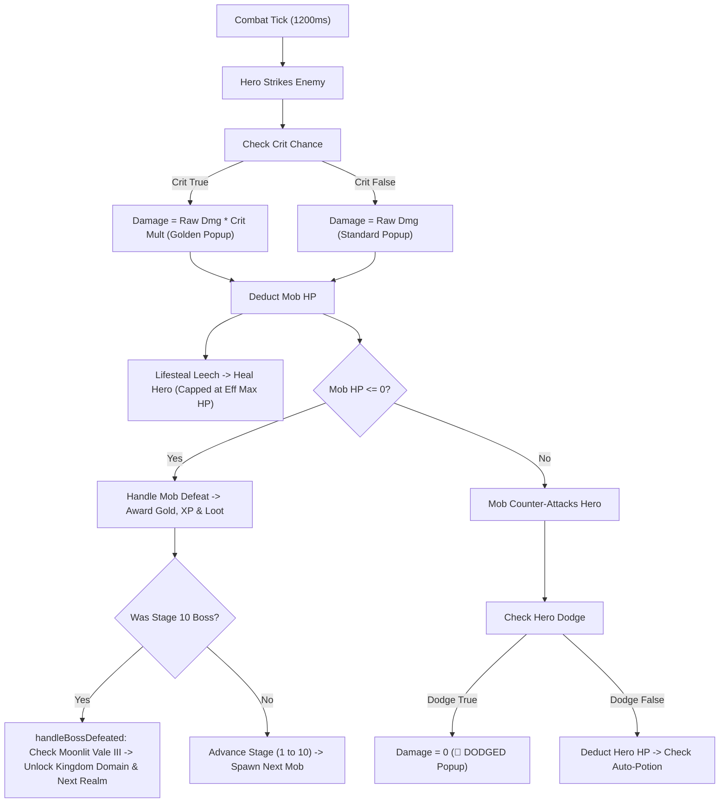
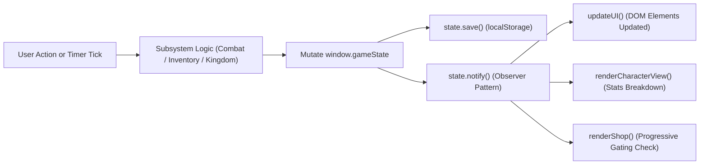

# Realm Idle RPG (Aincrad Edition) — Technical Architecture & Student Engineering Guide

A complete technical specification, architectural blueprint, and source-code dissection designed for web development students learning **HTML5**, **CSS3**, and **Modern JavaScript (ES6+)** through a real-world, production-ready Idle RPG application.

---

## Table of Contents
1. [Project Overview & Core Architecture](#1-project-overview--core-architecture)
2. [High-Level Architectural Patterns](#2-high-level-architectural-patterns)
3. [Complete Game Features & Systems Breakdown](#3-complete-game-features--systems-breakdown)
   - [3.1 Active Real-Time Combat Engine](#31-active-real-time-combat-engine)
   - [3.2 Character Sheet, Vocations & 5-Level Milestone Passives](#32-character-sheet-vocations--5-level-milestone-passives)
   - [3.3 Attributes & Stats Breakdown Engine](#33-attributes--stats-breakdown-engine)
   - [3.4 Equipment, Forge & Procedural Loot Generator](#34-equipment-forge--procedural-loot-generator)
   - [3.5 Consumables & Effective Max HP Healing](#35-consumables--effective-max-hp-healing)
   - [3.6 Progressive Realm Shop Catalog](#36-progressive-realm-shop-catalog)
   - [3.7 Maps, Depths & Stage Progression](#37-maps-depths--stage-progression)
   - [3.8 World Simulation (Day/Night, Weather & Cataclysm Events)](#38-world-simulation-daynight-weather--cataclysm-events)
   - [3.9 Kingdom Domain & Royal Charter Lore](#39-kingdom-domain--royal-charter-lore)
   - [3.10 Dynamic Quests & Adventurer's Guild Economy](#310-dynamic-quests--adventurers-guild-economy)
   - [3.11 Temple of Revival Tithe](#311-temple-of-revival-tithe)
   - [3.12 Live Admin / Game Master Studio (Cross-Tab Sync)](#312-live-admin--game-master-studio-cross-tab-sync)
4. [File-by-File Codebase Dissection](#4-file-by-file-codebase-dissection)
   - [Root HTML & CSS](#root-html--css)
   - [js/core/ — Unified State Machine](#jscore--unified-state-machine)
   - [js/main.js — Central Game Loop & View Controller](#jsmainjs--central-game-loop--view-controller)
   - [js/data/ — Data-Driven Configuration Dictionaries](#jsdata--data-driven-configuration-dictionaries)
   - [js/systems/ — Specialized Game Logic Modules](#jssystems--specialized-game-logic-modules)
   - [js/api/ & js/manager/ — GM Engine & Inter-Tab Broadcast](#jsapi--jsmanager--gm-engine--inter-tab-broadcast)
   - [js/dev/ & js/debug/ — Developer Tools](#jsdev--jsdebug--developer-tools)
5. [Syntax Quick Reference for Students (One-Line Explanations)](#5-syntax-quick-reference-for-students-one-line-explanations)
   - [HTML5 Syntax](#html5-syntax)
   - [CSS3 Syntax](#css3-syntax)
   - [JavaScript (ES6+) Syntax](#javascript-es6-syntax)
6. [Data Flow Diagrams](#6-data-flow-diagrams)

---

## 1. Project Overview & Core Architecture

**Realm Idle RPG** is a client-side, browser-based Idle Role-Playing Game styled after medieval fantasy and *Sword Art Online (Aincrad)*. 

The application is written in **vanilla HTML5, CSS3, and JavaScript**, without external dependencies (no React, no Vue, no jQuery, no build bundlers like Webpack or Vite). This makes it an ideal pedagogical reference for students wanting to master the fundamental building blocks of the web platform.

### Directory Structure
```
Realme Idle/
│
├── index.html                 # Main Player UI (HUD, Combat, Sheet, Inventory, Shop, Kingdom)
├── style.css                  # Core design system (Aincrad glassmorphism, responsive grid, animations)
├── manager.html               # Live Game Master / Admin Studio (CRUD editors, cheat suite)
├── manager.css                # Admin studio theme & layout styles
│
└── js/
    ├── main.js                # Core controller: game loops, DOM binding, view updates
    │
    ├── api/
    │   └── gameApi.js         # Cross-tab communication & public API (BroadcastChannel)
    │
    ├── core/
    │   └── state.js           # Single Source of Truth (State pattern, pub/sub, stat calculations)
    │
    ├── data/                  # Static game dictionaries (data-driven architecture)
    │   ├── heroes.js          # Classes, promotion ranks & 5-level divine passives
    │   ├── items.js           # Catalog, recipes, progressive ShopData & procedural loot
    │   ├── mobs.js            # Universal & realm monster definitions
    │   ├── maps.js            # Realms, depth tiers, background gradients & bosses
    │   ├── weather.js         # Weather conditions & stat multipliers
    │   ├── events.js          # Timed server-wide world events
    │   ├── scenarios.js       # Cataclysm events & combat modifiers
    │   └── alchemy.js         # Potion crafting recipes & material requirements
    │
    ├── systems/               # Specialized autonomous game subsystems
    │   ├── combat.js          # Attack resolution, boss phases, popups, auto-fight
    │   ├── inventory.js       # Equip/unequip, forge rolling, potions, scrap
    │   ├── spawning.js        # Mob lifecycle, universal random picks, boss spawning
    │   ├── kingdom.js         # Infrastructure upgrades (Castle, Treasury, Barracks)
    │   ├── quests.js          # Dynamic quest generation, tracking & rewards
    │   ├── time.js            # In-game 24h clock, celestial sun/moon positioning
    │   ├── weather.js         # Atmospheric simulation, natural weather switching
    │   ├── events.js          # World event timer tickers
    │   ├── scenarios.js       # Scenario active modifiers
    │   ├── maps.js            # Exploration, realm traversal, depth tier navigation
    │   └── journal.js         # Adventure event logging system
    │
    ├── manager/
    │   └── managerApp.js      # Game Master Studio application controller & form handlers
    │
    └── dev/                   # Developer console & testing overlays
        ├── devMode.js         # Dev mode flags & console logging helper
        ├── devPanel.js        # In-game cheat overlay
        └── commands.js        # Console slash commands
```

---

## 2. High-Level Architectural Patterns

Students should recognize three core software design patterns utilized throughout this codebase:

### 1. Single Source of Truth (The State Pattern)
All mutable data lives inside a single global object: [`window.gameState`](file:///c:/Users/nitin/OneDrive/Desktop/Real-main/Realme%20Idle/js/core/state.js).
- Individual subsystems (combat, inventory, shop) **never** create their own private tracking variables for player gold, health, or level.
- When any state changes, `state.notify()` is triggered, informing subscribed view-renderers to update the DOM.

### 2. Pub-Sub (Observer Pattern)
`window.gameState` implements a light Publish-Subscribe mechanism:
```javascript
state.subscribe(listenerFunction); // View registers interest
state.notify();                    // State calls all registered listeners on mutation
```
This cleanly decouples logic from presentation: the combat system inflicts damage on `state.player.hp` and calls `state.notify()`, without needing to know which DOM elements show the health bar.

### 3. Data-Driven Architecture
Game mechanics are separated from numerical balance data:
- Monsters are not hardcoded in JavaScript functions; they are defined in JSON-like configuration tables in [`mobs.js`](file:///c:/Users/nitin/OneDrive/Desktop/Real-main/Realme%20Idle/js/data/mobs.js).
- If a game designer wants to rebalance a monster's HP or add a new sword, they edit a data dictionary rather than touching the combat engine.

---

## 3. Complete Game Features & Systems Breakdown

### 3.1 Active Real-Time Combat Engine
- **Files**: [`combat.js`](file:///c:/Users/nitin/OneDrive/Desktop/Real-main/Realme%20Idle/js/systems/combat.js), [`spawning.js`](file:///c:/Users/nitin/OneDrive/Desktop/Real-main/Realme%20Idle/js/systems/spawning.js)
- **Mechanics**:
  - **Attack Tick**: Ticks every ~1.2 seconds. Hero strikes enemy, followed immediately by enemy retaliating.
  - **Damage Formulas**:
    $$\text{Hero Raw Damage} = \max(1, \text{Hero Effective Attack} - \text{Enemy Defense})$$
    $$\text{Enemy Raw Damage} = \max(1, \text{Enemy Attack} - \text{Hero Effective Defense})$$
  - **Critical Hits**: Probability checked against `getEffectiveCritChance()`. On success, damage is multiplied by `player.critDmg` (default `1.5x` to `2.0x`) and triggers an enlarged golden popup with screen shake.
  - **Dodge Evasion**: Probability checked against `getEffectiveDodge()`. If triggered, damage is nullified and a floating `💨 DODGED!` popup appears.
  - **Lifesteal**: Percentage leech governed by `getEffectiveLifesteal()`. Heals hero for a fraction of damage dealt, capped at `getEffectiveMaxHp()`.
  - **Multi-Phase Bosses**: At Stage 10 of each depth, a Guardian Boss spawns. When Boss HP drops below 50%, they enter **Phase 2** (boosted attack speed). When below 25%, they enter **Frenzy Phase 3** (+30% attack power).
  - **Floating Combat Popups**: Dynamically rendered `<span>` tags appended to `#combatArea` that float upward via CSS animation and remove themselves from the DOM using `setTimeout(..., 800)`.

### 3.2 Character Sheet, Vocations & 5-Level Milestone Passives
- **Files**: [`heroes.js`](file:///c:/Users/nitin/OneDrive/Desktop/Real-main/Realme%20Idle/js/data/heroes.js), [`state.js`](file:///c:/Users/nitin/OneDrive/Desktop/Real-main/Realme%20Idle/js/core/state.js), [`main.js`](file:///c:/Users/nitin/OneDrive/Desktop/Real-main/Realme%20Idle/js/main.js)
- **Vocations (Classes)**:
  1. **Knight Templar**: Tank class with high baseline Defense, +50% shield scaling, and *Shield Slam* skill.
  2. **Shadow Rogue**: High Crit Chance (25%), 2.0x Crit Damage, +15% innate Dodge, and *Shadowstrike*.
  3. **Arcane Archmage**: Highest base Attack Power (55), innate 5% Lifesteal, and *Arcane Meteor*.
  4. **Holy Paladin**: Hybrid durability with holy sustain, 25% heal skill (*Holy Radiance*).
- **Vocation Ascension Promotions**:
  - Rank 2 unlocks at **Hero Level 10** (requires gold + starter materials like Hardwood and Iron Ore).
  - Rank 3 unlocks at **Hero Level 20** (requires Arcane Crystals and Dragon Scales).
- **Divine Passives ("Blessed by the Gods")**:
  - Unlocked **strictly at 5-level milestone iterations**: **Lv. 1, 5, 10, 15, 20, 25, 30**.
  - Each passive includes rich mythological lore (*"You have been blessed by the gods: Sol Invictus infuses your shield..."*) and applies permanent additive bonuses to Attack, Defense, Max HP, Dodge, Crit, or Lifesteal.

### 3.3 Attributes & Stats Breakdown Engine
- **Files**: [`state.js`](file:///c:/Users/nitin/OneDrive/Desktop/Real-main/Realme%20Idle/js/core/state.js) (`getStatBreakdown()`), [`main.js`](file:///c:/Users/nitin/OneDrive/Desktop/Real-main/Realme%20Idle/js/main.js)
- **Features**:
  - Rather than showing a single aggregated number, the Character Sheet renders **baseline class stats separated from equipment and passive additions**.
  - **Syntax / Output**:
    `40 + 15 + 6 (= 61)` or `258 + 12 + 12 (= 282)`
  - **Detailed Hover Tooltips**: The HTML `title` attribute dynamically renders the source of every single point:
    `Base Class: 40 | Iron Broadsword [WEAPON]: +15 | Copper Band [RING]: +6 | Total: 61`
  - Subtle dotted underline with hover gold transition (`.stat-line strong.has-breakdown`) signals interactivity to the player.

### 3.4 Equipment, Forge & Procedural Loot Generator
- **Files**: [`inventory.js`](file:///c:/Users/nitin/OneDrive/Desktop/Real-main/Realme%20Idle/js/systems/inventory.js), [`items.js`](file:///c:/Users/nitin/OneDrive/Desktop/Real-main/Realme%20Idle/js/data/items.js)
- **Slots**: `Weapon`, `Armor`, `Trinket` (Ring).
- **Rarity Tiers**: Common (White), Uncommon (Green), Rare (Blue), Epic (Purple), Legendary (Gold).
- **Procedural Gear Roller (`window.rollItem(rarity, slot, ilvl)`)**:
  - Selects random medieval SAO-style prefixes (*Rusty*, *Sturdy*, *Sharp*, *Blessed*, *Aincrad*, *Radiant*, *Abyssal*).
  - Selects base equipment (*Elucidator*, *Short Sword*, *Dark Cloak*, *Ruby Ring*).
  - Scales stat attributes proportionally with the item's item level (`ilvl`) and rarity multiplier.
- **The 3-Tier Forge**:
  1. *Basic Forge* (250g, Lv. 1): Common items with a chance of Rare.
  2. *Master Forge* (1,600g, Lv. 10): Reliable Rare equipment, occasionally Epic.
  3. *Aincrad Forge* (9,000g, Lv. 25): Guaranteed Epic with a chance of Legendary relic.
- **Scrapping & Selling**: Equipment can be sold for gold or dismantled into raw crafting ores.

### 3.5 Consumables & Effective Max HP Healing
- **Files**: [`inventory.js`](file:///c:/Users/nitin/OneDrive/Desktop/Real-main/Realme%20Idle/js/systems/inventory.js), [`state.js`](file:///c:/Users/nitin/OneDrive/Desktop/Real-main/Realme%20Idle/js/core/state.js)
- **Effective Max HP Calculation**:
  $$\text{Effective Max HP} = \text{Base HP} + \text{Armor HP} + \text{Passive HP} + \text{Castle HP} + \text{Upgrade HP}$$
- **Potion Integrity**:
  - `usePotion()` verifies player health against `getEffectiveMaxHp()`.
  - **Full HP Protection**: If player is at 100% health, the potion is preserved and displays `HP FULL!` in yellow.
  - Healing restores up to `effMaxHp` without wasteful overflow or `+0 HP` truncation.

### 3.6 Progressive Realm Shop Catalog
- **Files**: [`items.js`](file:///c:/Users/nitin/OneDrive/Desktop/Real-main/Realme%20Idle/js/data/items.js), [`main.js`](file:///c:/Users/nitin/OneDrive/Desktop/Real-main/Realme%20Idle/js/main.js)
- **Progression Gating**:
  - Shop items are tagged with `reqMap` and `reqDepth`.
  - **Moonlit Vale Depth 1 (Starter)**: Hardwood, Iron Ore, Minor Health Potion, Iron Broadsword, Iron Plate, Copper Band.
  - **Moonlit Vale Depths 2 & 3**: Greater Health Potion, Arcane Crystal, Steel Rapier, Hardened Leather Armor.
  - **Ashen Wastes (Realm II)**: Berserker Draught, Jade Signet, Runed Broadsword.
  - **Bloodthorn Forest (Realm III)**: Elixir of Ironbark, Dragon Scale, Shadow Cowl.
  - **Frostpeak & Infernal Depths (Realms IV & V)**: Elixir of Rebirth, Shadow Essence, Ring of Imperial Wealth.
- **Visual Feedback**: Locked items display explicit lock badges (`🔒 Unlocks: Moonlit Vale II`, `🔒 Unlocks: Ashen Wastes I`).

### 3.7 Maps, Depths & Stage Progression
- **Files**: [`maps.js`](file:///c:/Users/nitin/OneDrive/Desktop/Real-main/Realme%20Idle/js/data/maps.js), [`maps.js`](file:///c:/Users/nitin/OneDrive/Desktop/Real-main/Realme%20Idle/js/systems/maps.js)
- **Realms**:
  1. *Realm I: Moonlit Vale* (Levels 1–5)
  2. *Realm II: Ashen Wastes* (Levels 5–15)
  3. *Realm III: Bloodthorn Forest* (Levels 15–25)
  4. *Realm IV: Frostpeak Citadel* (Levels 25–40)
  5. *Realm V: Infernal Depths* (Levels 40–60)
- **Depth Versions (e.g. Forest I, Forest II, Forest III)**:
  - Each realm contains 3 depth tiers (e.g. *Fringe Clearing*, *Deep Thicket*, *Heart of the Vale*).
  - Completing Stage 10 Boss in Depth I unlocks Depth II; clearing Depth III unlocks the portal to Realm II.

### 3.8 World Simulation (Day/Night, Weather & Cataclysm Events)
- **Files**: [`time.js`](file:///c:/Users/nitin/OneDrive/Desktop/Real-main/Realme%20Idle/js/systems/time.js), [`weather.js`](file:///c:/Users/nitin/OneDrive/Desktop/Real-main/Realme%20Idle/js/systems/weather.js), [`events.js`](file:///c:/Users/nitin/OneDrive/Desktop/Real-main/Realme%20Idle/js/systems/events.js), [`scenarios.js`](file:///c:/Users/nitin/OneDrive/Desktop/Real-main/Realme%20Idle/js/systems/scenarios.js)
- **Day/Night Cycle**: Simulated 24-hour clock. Dynamically rotates sun and moon emoji icons in the HUD sky tracker.
- **Dynamic Weather**: Clear, Heavy Rain (+25% Gold loot), Ashfall (-10% Hero Def, +20% Gold), Fog (+15% Dodge).
- **Cataclysm Scenarios**: Activated via Game Master Studio or timed triggers (e.g. *Black Moon: All Monsters Enraged*, *Blood Eclipse*, *Celestial Solstice*).
- **Main Screen HUD Strip (`#worldStatusStrip`)**: Positioned directly above player bars, showing live weather multipliers and scenario timer countdowns with glowing CSS animations.

### 3.9 Kingdom Domain & Royal Charter Lore
- **Files**: [`index.html`](file:///c:/Users/nitin/OneDrive/Desktop/Real-main/Realme%20Idle/index.html), [`kingdom.js`](file:///c:/Users/nitin/OneDrive/Desktop/Real-main/Realme%20Idle/js/systems/kingdom.js), [`state.js`](file:///c:/Users/nitin/OneDrive/Desktop/Real-main/Realme%20Idle/js/core/state.js)
- **Unlock Conditions**:
  1. Hero Level $\ge 5$.
  2. Slaying the Guardian Boss of Moonlit Vale III.
- **Locked State**: Shows an ancient royal decree card:
  > *"Long has Moonlit Vale suffered under foul predatory beasts prowling its ancient depths. The High King has issued a royal decree: only the stalwart champion who reaches Level 5 and vanishes the prime foul beast from Moonlit Vale III shall be granted sovereign lands to establish their dominion."*
- **Unlocked State**: Unveils the sovereign stronghold banner:
  > *"Having banished the foul beasts from this forest, the High King granted him sovereign land to establish his citadel and command the realm's infrastructure."*
- **Buildings**:
  - **Castle**: +25 Max HP per level.
  - **Treasury**: +10% Gold Income per level.
  - **Blacksmith**: +5% Attack & Gear Scaling per level.
  - **Mage Tower**: +2% Crit Chance per level.
  - **Barracks**: +5% Base Attack per level.

### 3.10 Dynamic Quests & Adventurer's Guild Economy
- **Files**: [`quests.js`](file:///c:/Users/nitin/OneDrive/Desktop/Real-main/Realme%20Idle/js/systems/quests.js)
- **Quest System**: Auto-generates objectives (slay 8 wolves, collect 300 gold, defeat 1 boss). Completing awards gold and XP.
- **Passive Guild Stipend**: The Adventurer's Guild provides continuous gold income per second ($3\text{g/s}$ base + upgrade scaling + treasury multipliers).

### 3.11 Temple of Revival Tithe
- When hero HP reaches 0, hero does not suffer permadeath. Instead, the hero is recovered at the **Temple of Revival**, restored to 50% HP, and a tithe (50g) is deducted if funds allow.

### 3.12 Live Admin / Game Master Studio (Cross-Tab Sync)
- **Files**: [`manager.html`](file:///c:/Users/nitin/OneDrive/Desktop/Real-main/Realme%20Idle/manager.html), [`managerApp.js`](file:///c:/Users/nitin/OneDrive/Desktop/Real-main/Realme%20Idle/js/manager/managerApp.js), [`gameApi.js`](file:///c:/Users/nitin/OneDrive/Desktop/Real-main/Realme%20Idle/js/api/gameApi.js)
- **Inter-Tab BroadcastChannel**:
  - Opening `index.html` in Tab 1 and `manager.html` in Tab 2 allows the Game Master to modify mob HP, spawn monsters, change weather, trigger cataclysms, or edit shop merchandise live without refreshing either page.
  - Changes instantly serialize to `localStorage` and transmit over `new BroadcastChannel("realm_idle_sync")`.

---

## 4. File-by-File Codebase Dissection

### Root HTML & CSS

#### [`index.html`](file:///c:/Users/nitin/OneDrive/Desktop/Real-main/Realme%20Idle/index.html)
- **Role**: Main game interface.
- **Key Elements**:
  - `#worldStatusStrip`: Live weather and scenario HUD above player health bars.
  - `#hpBar`, `#xpBar`: HTML5 animated progress meters using `width: %`.
  - `#combatArea`: Arena view showing hero emoji, active mob card, stage counter, and floating damage numbers.
  - `#eqSlot_weapon`, `#eqSlot_armor`, `#eqSlot_ring`: Visual equipment slots.
  - `#kingdomPanel`: Dynamic dual-state container (`#kingdomLockedState` vs `#kingdomUnlockedState`).
  - `#tab_character`, `#tab_inventory`, `#tab_shop`, `#tab_journal`: Tabbed sub-panels switched via JS class toggling.

#### [`style.css`](file:///c:/Users/nitin/OneDrive/Desktop/Real-main/Realme%20Idle/style.css)
- **Role**: Visual design system and styling rules.
- **Key Concepts for Students**:
  - CSS Custom Properties (`:root { --bg: #07060c; --panel: #141122; --gold: #f2c94c; }`) for global theme management.
  - CSS Grid (`grid-template-columns: 1fr 1fr;`) and Flexbox (`display: flex; justify-content: space-between;`).
  - Glassmorphism: `backdrop-filter: blur(12px); background: rgba(20, 17, 34, 0.85);`.
  - Keyframe Animations (`@keyframes floatUp`, `@keyframes pulseGlow`).
  - Responsive Media Queries (`@media (max-width: 768px)`).

#### [`manager.html`](file:///c:/Users/nitin/OneDrive/Desktop/Real-main/Realme%20Idle/manager.html) & [`manager.css`](file:///c:/Users/nitin/OneDrive/Desktop/Real-main/Realme%20Idle/manager.css)
- **Role**: Game Master studio suite with 8 tabbed CRUD forms (Dashboard, Mobs, Items, Shop, Maps, Vocations, Weather/Events, Alchemy).

---

### `js/core/` — Unified State Machine

#### [`js/core/state.js`](file:///c:/Users/nitin/OneDrive/Desktop/Real-main/Realme%20Idle/js/core/state.js)
- **Role**: Master data repository and calculation hub.
- **Core State Tree**:
  - `state.player`: Name, class, level, gold, HP, equipped gear, potion counts, materials, passives, `moonlitVale3Cleared`.
  - `state.world`: Current map ID, weather, clock hour, active events, unlocked maps and depths.
  - `state.combat`: Active mob instance, stage (1–10), auto-fight toggle.
  - `state.kingdom`: Building level counters (Castle, Treasury, Blacksmith, etc.).
- **Key Methods**:
  - `getEffectiveAttack()`, `getEffectiveDefense()`, `getEffectiveMaxHp()`, `getEffectiveCritChance()`, `getEffectiveDodge()`, `getEffectiveLifesteal()`: Aggregates class base, level growth, permanent upgrades, equipment stats, building multipliers, and divine passives.
  - `getStatBreakdown(statKey)`: Generates separated display strings (`258 + 12 + 12`) and full hover tooltips.
  - `isKingdomDomainUnlocked()`: Returns boolean verification of Hero Lv 5 + Moonlit Vale III boss defeat.
  - `save()` / `load()`: Serializes state to `localStorage.getItem("realmIdleRootSave")`.

---

### `js/main.js` — Central Game Loop & View Controller

#### [`js/main.js`](file:///c:/Users/nitin/OneDrive/Desktop/Real-main/Realme%20Idle/js/main.js)
- **Role**: Initializes all systems, binds DOM events, manages tick loops, and renders the user interface.
- **Tick Loops**:
  - `gameLoop` (100ms): Updates game clock, checks cooldowns, triggers passive income accumulation.
  - `combatLoop` (1200ms): Triggers automatic combat attack cycles when auto-fight is enabled.
- **Key Functions**:
  - `updateUI()`: Master renderer synchronizing state numbers with DOM elements (health bar, gold display, status strip).
  - `renderCharacterView()`: Renders character stats using `getStatBreakdown()`, class cards, and promotion buttons.
  - `renderInventoryView()`: Renders inventory backpack grid, equipment tooltips, and forge buttons.
  - `renderShop()`: Renders progressive shop catalog with map/depth lock filtering.

---

### `js/data/` — Data-Driven Configuration Dictionaries

- [`heroes.js`](file:///c:/Users/nitin/OneDrive/Desktop/Real-main/Realme%20Idle/js/data/heroes.js): Definitions for Knight, Rogue, Mage, and Paladin, promotion ranks, and 5-level divine passives.
- [`items.js`](file:///c:/Users/nitin/OneDrive/Desktop/Real-main/Realme%20Idle/js/data/items.js): Crafting recipes, Forge tier tables, progressive `ShopData`, and procedural item roller `window.rollItem`.
- [`mobs.js`](file:///c:/Users/nitin/OneDrive/Desktop/Real-main/Realme%20Idle/js/data/mobs.js): Monster catalog with base HP, damage, gold reward, XP reward, and dynamic drop tables.
- [`maps.js`](file:///c:/Users/nitin/OneDrive/Desktop/Real-main/Realme%20Idle/js/data/maps.js): Realms, background gradients, stage 10 bosses, and depth tier subtitles (*Fringe Clearing*, *Deep Thicket*, *Heart*).
- [`weather.js`](file:///c:/Users/nitin/OneDrive/Desktop/Real-main/Realme%20Idle/js/data/weather.js): Weather states and stat multipliers (goldMult, dropMult, dmgMult).
- [`events.js`](file:///c:/Users/nitin/OneDrive/Desktop/Real-main/Realme%20Idle/js/data/events.js) & [`scenarios.js`](file:///c:/Users/nitin/OneDrive/Desktop/Real-main/Realme%20Idle/js/data/scenarios.js): Cataclysm events and battle scenario modifiers.
- [`alchemy.js`](file:///c:/Users/nitin/OneDrive/Desktop/Real-main/Realme%20Idle/js/data/alchemy.js): Potion and elixir crafting recipes.

---

### `js/systems/` — Specialized Game Logic Modules

- [`combat.js`](file:///c:/Users/nitin/OneDrive/Desktop/Real-main/Realme%20Idle/js/systems/combat.js): Resolves hero vs mob combat rounds, boss phase transitions, auto-potion checks, floating damage popups, and stage completion.
- [`inventory.js`](file:///c:/Users/nitin/OneDrive/Desktop/Real-main/Realme%20Idle/js/systems/inventory.js): Manages equipping gear, un-equipping slots, forge crafting rolls, potion drinking, and item scrapping.
- [`spawning.js`](file:///c:/Users/nitin/OneDrive/Desktop/Real-main/Realme%20Idle/js/systems/spawning.js): Selects mobs matching current realm and stage tier; spawns stage 10 boss guardian.
- [`kingdom.js`](file:///c:/Users/nitin/OneDrive/Desktop/Real-main/Realme%20Idle/js/systems/kingdom.js): Handles infrastructure upgrades with quadratic cost formulas ($C = \text{base} \times 1.65^{\text{level}-1}$).
- [`quests.js`](file:///c:/Users/nitin/OneDrive/Desktop/Real-main/Realme%20Idle/js/systems/quests.js): Tracks objective criteria and triggers reward claims.
- [`time.js`](file:///c:/Users/nitin/OneDrive/Desktop/Real-main/Realme%20Idle/js/systems/time.js): Increments world time clock and updates celestial sky markers.
- [`weather.js`](file:///c:/Users/nitin/OneDrive/Desktop/Real-main/Realme%20Idle/js/systems/weather.js): Rotates natural weather patterns and applies realm weather effects.
- [`maps.js`](file:///c:/Users/nitin/OneDrive/Desktop/Real-main/Realme%20Idle/js/systems/maps.js): Depth tier navigation and realm map switching.
- [`journal.js`](file:///c:/Users/nitin/OneDrive/Desktop/Real-main/Realme%20Idle/js/systems/journal.js): Records timestamped battle, level-up, and drop event logs.

---

### `js/api/` & `js/manager/` — GM Engine & Inter-Tab Broadcast

- [`gameApi.js`](file:///c:/Users/nitin/OneDrive/Desktop/Real-main/Realme%20Idle/js/api/gameApi.js): Broadcasts events across browser tabs using `BroadcastChannel("realm_idle_sync")` and exports/imports full state JSON.
- [`managerApp.js`](file:///c:/Users/nitin/OneDrive/Desktop/Real-main/Realme%20Idle/js/manager/managerApp.js): Handles all admin form submits, dynamic drop table builders, live mob spawns, and catalog editing.

---

## 5. Syntax Quick Reference for Students (One-Line Explanations)

This section provides concise, single-line syntax explanations of key language features used in this project.

### HTML5 Syntax
- `<section class="panel">` — Semantic container tag grouping related thematic content together.
- `<header>`, `<main>`, `<aside>` — Semantic layout tags organizing document structure for accessibility and search engines.
- `<div id="hpBar" class="bar">` — Generic division container; `id` is a unique page identifier, `class` is a reusable style group.
- `<button type="button" disabled>` — Interactive clickable button; `disabled` attribute prevents user clicks and greys out element.
- `<input type="number" min="1" max="10">` — Form input field restricted to numerical values between 1 and 10.
- `<select id="shopFilter">` — Dropdown selection menu containing `<option>` child elements.
- `<span data-item-id="potion_minor">` — Custom data attribute (`data-*`) storing arbitrary key-value data on an HTML element.
- `title="Detailed Breakdown"` — Standard tooltip attribute showing hover text in the browser.
- `<strong id="charStatAttack">` — Semantic element indicating bold, important text.
- `<link rel="stylesheet" href="style.css">` — Links an external CSS stylesheet into the HTML document.
- `<script src="js/main.js"></script>` — Loads and executes an external JavaScript file.

### CSS3 Syntax
- `:root { --gold: #f2c94c; }` — Declares global CSS custom property (variable) reusable anywhere with `var(--gold)`.
- `display: flex; justify-content: space-between; align-items: center;` — Flexbox layout aligning children along main and cross axes.
- `display: grid; grid-template-columns: repeat(2, 1fr); gap: 12px;` — 2-column grid layout with equal 1-fraction fractional widths.
- `backdrop-filter: blur(12px);` — Glassmorphism effect blurring graphical content behind an element's background.
- `box-sizing: border-box;` — Ensures element padding and borders are included within total declared width and height.
- `transition: all 0.2s ease;` — Smoothly animates property changes over 0.2 seconds with an ease timing curve.
- `@keyframes pulseGlow { 0% { opacity: 0.6; } 100% { opacity: 1; } }` — Defines reusable keyframe animation stages.
- `animation: pulseGlow 1.8s infinite alternate;` — Binds defined keyframe animation to loop infinitely.
- `.card:hover { transform: translateY(-2px); }` — Pseudo-class applying styles when user hovers mouse cursor over element.
- `button:disabled { opacity: 0.5; cursor: not-allowed; }` — Targets buttons in a disabled state to give visual inactive feedback.
- `@media (max-width: 768px) { ... }` — Responsive breakpoint applying rules only on screens 768px wide or narrower.

### JavaScript (ES6+) Syntax
- `const x = 10; let y = 20;` — `const` declares block-scoped immutable references; `let` declares block-scoped reassignable variables.
- `(a, b) => a + b` — Arrow function providing concise anonymous function syntax and lexical `this` binding.
- `document.getElementById("hpBar")` — DOM method retrieving a single HTML element matching a specific unique ID string.
- `document.querySelector(".shop-card")` — DOM method retrieving the first element matching any CSS selector query.
- `el.addEventListener("click", () => { ... })` — Attaches an asynchronous event handler listening for user interactions.
- `el.textContent = "Hello";` — Safely sets plain text content of a DOM element without parsing HTML tags.
- `el.innerHTML = "<span>Text</span>";` — Parses and renders HTML markup directly inside a DOM element.
- `el.classList.add("met"); el.classList.remove("unmet");` — Dynamically adds or removes CSS class names on an element.
- `Object.entries(myObj).forEach(([k, v]) => ...)` — Converts an object into an array of `[key, value]` pairs and loops through each.
- `arr.filter(item => item.level >= 5)` — Returns a new array containing only elements satisfying the test condition.
- `arr.map(item => item.name)` — Transforms each array element and returns a new array with the mapped results.
- `arr.find(item => item.id === targetId)` — Returns the first element in an array matching the predicate condition.
- `Math.floor(x)` / `Math.round(x)` — Mathematical functions rounding floating-point numbers downward or to nearest integer.
- `Math.max(1, x)` — Returns the greater value, frequently used in games to prevent numbers from falling below 1.
- `localStorage.setItem(key, JSON.stringify(data))` — Persists serialized object data across browser restarts in browser storage.
- `JSON.parse(localStorage.getItem(key))` — Deserializes stored JSON text string back into live JavaScript objects.
- `new BroadcastChannel("my_channel")` — Modern web API enabling real-time messaging between multiple open tabs under same origin.
- `setInterval(() => tick(), 1000)` — Calls a function repeatedly at a fixed millisecond time interval.
- `setTimeout(() => remove(), 800)` — Schedules a one-time callback function execution after a specified millisecond delay.
- `const copy = { ...original, bonus: 10 };` — Spread operator creating shallow copies of objects while overriding properties.

---

## 6. Data Flow Diagrams

### Combat & Damage Resolution Flow


### State Mutation & UI Synchronization Flow

